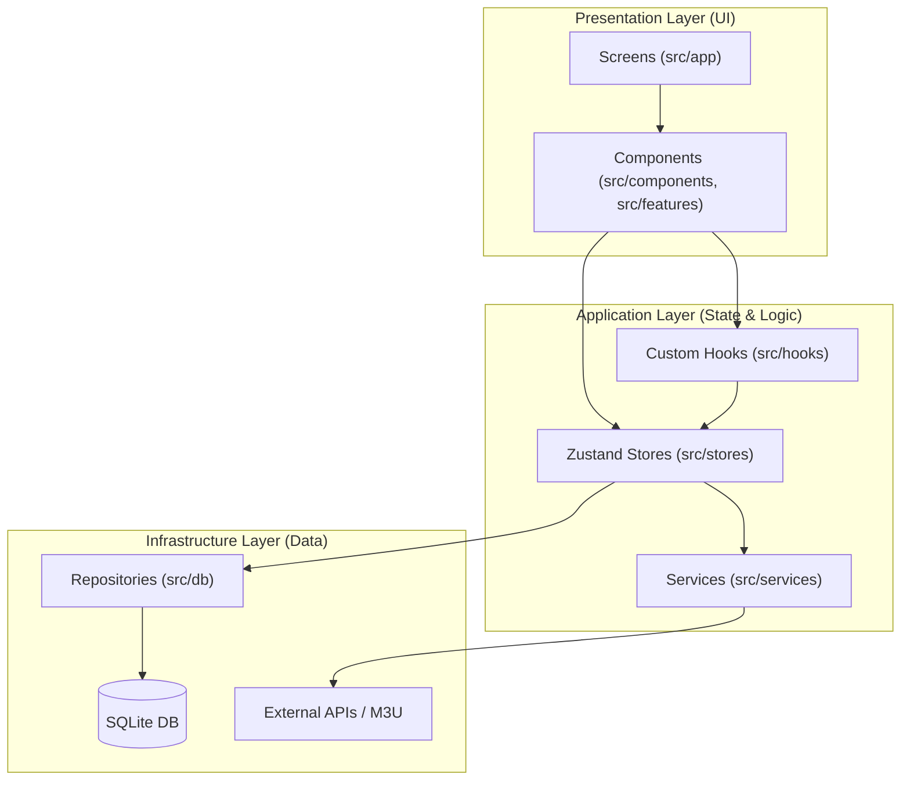
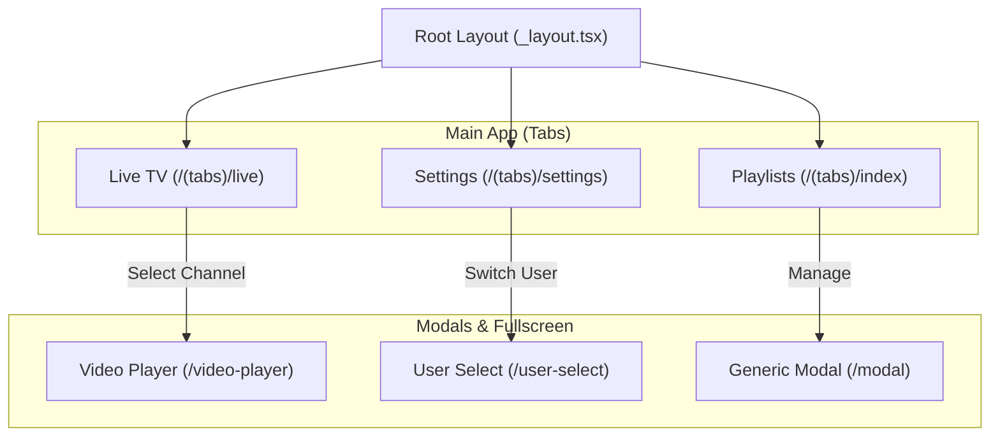
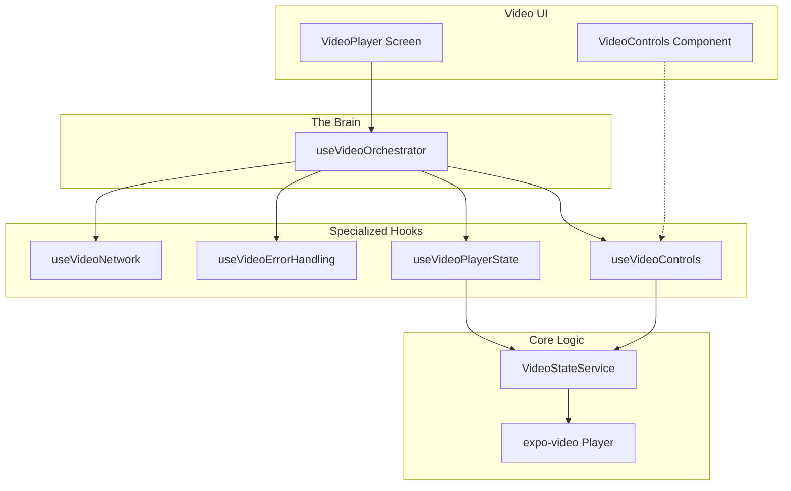

# System Architecture

This document provides a high-level overview of the IPTV Mobile architecture. The project follows clean architecture principles, emphasizing separation of concerns, modularity, and testability.

## 1. High-Level Overview

The application is structured into three primary layers:

- **Presentation Layer (UI):** Expo Router for navigation and React components styled with Tailwind (NativeWind).
- **Application Layer (Logic):** Zustand for state management and specialized services for business logic.
- **Infrastructure Layer (Data):** Repositories for data persistence (SQLite) and external network services.

## 2. Navigation & Routing (Expo Router)

The app uses file-based routing with a tab-based primary interface and modals for secondary interactions.

- **Main Tabs:** Playlists (Index), Live TV, and Settings.
- **Root Routes:** Full-screen Video Player and User Selection.

## 3. Video Player Module

The Video Player is the most complex module, utilizing an **Orchestrator Pattern** to manage playback, network state, error handling, and UI controls independently.

- **Orchestrator:** `useVideoOrchestrator` acts as the central hub.
- **Specialized Hooks:** Logic is split into network, error, state, and control hooks.
- **Service Layer:** `VideoStateService` provides pure utility functions for player interaction.

## 4. State Management (Zustand)

State is decentralized into domain-specific stores located in `src/stores/`:

- **Playlist Store:** Manages M3U content, parsing status, and list of available playlists.
- **User Store:** Manages user profiles and global preferences.
- **Video Store:** Split into sub-stores (Player, UI, Network, Error) to prevent unnecessary re-renders in the playback UI.

## 5. Domain Documentation

For deeper dives into specific domains, refer to:
- [Playlist Architecture](./playlist-architecture.md)
- [Playlist Usage](./playlist-usage.md)
