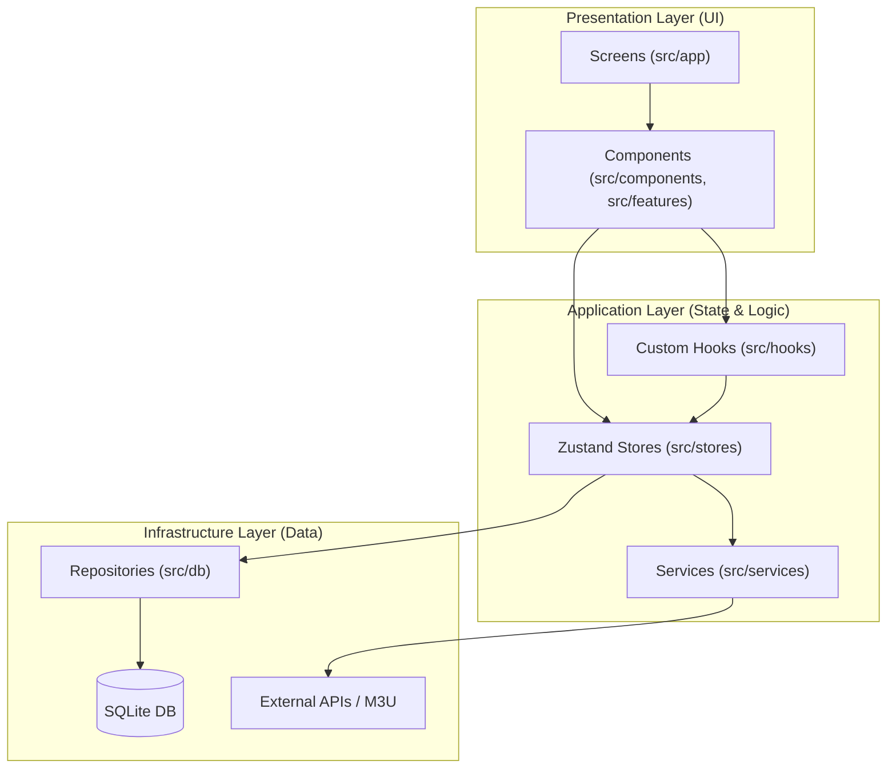
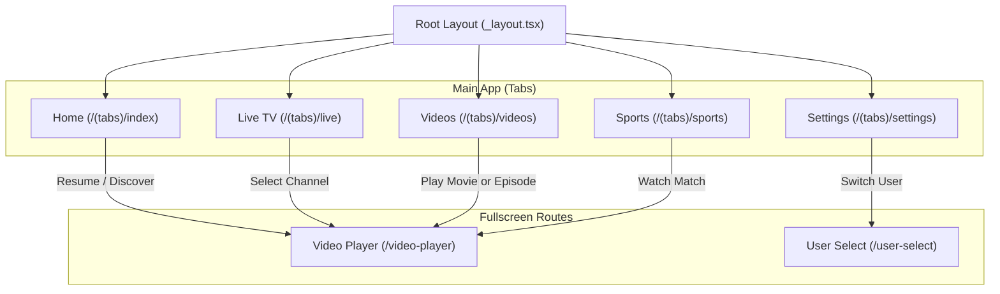
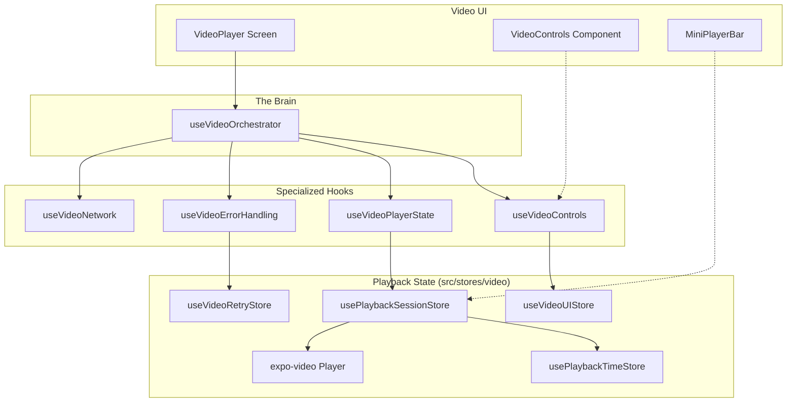

# System Architecture

This document provides a high-level overview of the IPTV Mobile architecture. The project follows clean architecture principles, emphasizing separation of concerns, modularity, and testability.

## 1. High-Level Overview

The application is structured into three primary layers:

- **Presentation Layer (UI):** Expo Router for navigation and React components styled with Tailwind (NativeWind).
- **Application Layer (Logic):** Zustand for state management and specialized services for business logic.
- **Infrastructure Layer (Data):** Repositories for data persistence (SQLite) and external network services.

```mermaid
graph TD
    subgraph "Presentation Layer (UI)"
        Screens["Screens (src/app)"]
        Components["Components (src/components, src/features)"]
    end

    subgraph "Application Layer (State & Logic)"
        Stores["Zustand Stores (src/stores)"]
        Hooks["Custom Hooks (src/hooks)"]
        Services["Services (src/services)"]
    end

    subgraph "Infrastructure Layer (Data)"
        Repo["Repositories (src/db)"]
        SQLite[("SQLite DB")]
        API["External APIs / M3U"]
    end

    Screens --> Components
    Components --> Hooks
    Components --> Stores
    Hooks --> Stores
    Stores --> Services
    Stores --> Repo
    Services --> API
    Repo --> SQLite
```

## 2. Navigation & Routing (Expo Router)

The app uses file-based routing: a tab bar for the primary surfaces, plus
full-screen routes outside it. Secondary interactions are rendered as in-place
modal components, not as routes.

- **Main Tabs:** Home (Index), Live TV, Videos, Sports, and Settings. Which tabs
  are shown is a per-user setting (`showHomeTab`, `showLiveTab`, …).
- **Root Routes:** Video Player and User Selection.

```mermaid
graph TD
    Root["Root Layout (_layout.tsx)"]

    subgraph "Main App (Tabs)"
        Home["Home (/(tabs)/index)"]
        Live["Live TV (/(tabs)/live)"]
        Videos["Videos (/(tabs)/videos)"]
        Sports["Sports (/(tabs)/sports)"]
        Settings["Settings (/(tabs)/settings)"]
    end

    subgraph "Fullscreen Routes"
        Player["Video Player (/video-player)"]
        UserSel["User Select (/user-select)"]
    end

    Root --> Home
    Root --> Live
    Root --> Videos
    Root --> Sports
    Root --> Settings

    Home -- "Resume / Discover" --> Player
    Live -- "Select Channel" --> Player
    Videos -- "Play Movie or Episode" --> Player
    Sports -- "Watch Match" --> Player
    Settings -- "Switch User" --> UserSel
```

## 3. Video Player Module

The Video Player is the most complex module, using an **Orchestrator Pattern** to
manage playback, network state, error handling and UI controls independently.

- **Orchestrator:** `useVideoOrchestrator` is the central hub for the player
  *screen*.
- **Specialized Hooks:** logic is split into network, error, state, control and
  gesture hooks under `features/video/hooks/specialized/`.
- **Session store:** `usePlaybackSessionStore` owns the `expo-video` player and
  outlives the screen, so playback survives into the mini player bar. There is no
  service layer between the hooks and the player — the stores are the seam.
- **Viewing history** is tracked by `PlaybackSessionHost`, not by the screen, so
  progress keeps recording while a session plays in the mini bar.

```mermaid
graph TD
    subgraph "Video UI"
        Screen["VideoPlayer Screen"]
        UI_Controls["VideoControls Component"]
        Mini["MiniPlayerBar"]
    end

    subgraph "The Brain"
        Orchestrator["useVideoOrchestrator"]
    end

    subgraph "Specialized Hooks"
        H_Net["useVideoNetwork"]
        H_Err["useVideoErrorHandling"]
        H_State["useVideoPlayerState"]
        H_Ctrl["useVideoControls"]
    end

    subgraph "Playback State (src/stores/video)"
        Session["usePlaybackSessionStore"]
        Time["usePlaybackTimeStore"]
        UIStore["useVideoUIStore"]
        Retry["useVideoRetryStore"]
        ExpoVideo["expo-video Player"]
    end

    Screen --> Orchestrator
    Orchestrator --> H_Net
    Orchestrator --> H_Err
    Orchestrator --> H_State
    Orchestrator --> H_Ctrl

    H_State --> Session
    H_Ctrl --> UIStore
    H_Err --> Retry
    Session --> ExpoVideo
    Session --> Time
    Mini -.-> Session

    UI_Controls -.-> H_Ctrl
```

## 4. State Management (Zustand)

State is decentralized into domain-specific stores located in `src/stores/`:

- **Playlist Store:** the list of playlists and their import lifecycle. The
  channel catalogue itself lives in the Rust backend, not in this store.
- **User Store:** user profiles, settings, favourites and watch history.
- **Cache Store:** `first-page-cache-store` holds the pre-fetched first page of
  each tab so a tab renders before its own query returns.
- **Video Stores:** split by concern (`playback-session`, `playback-time`,
  `player`, `ui`, `gesture`, `queue`, `retry`, `cast-mini-player`) so a per-frame
  timeline update cannot re-render the whole playback UI.

## 5. Domain Documentation

For deeper dives into specific domains, refer to:
- [Playlist Architecture](./playlist-architecture.md)
- [Playlist Usage](./playlist-usage.md)
- [Catch-up](./catchup.md)
- [Recommendations](./recommendations.md)
- [Conventions](./conventions.md)
